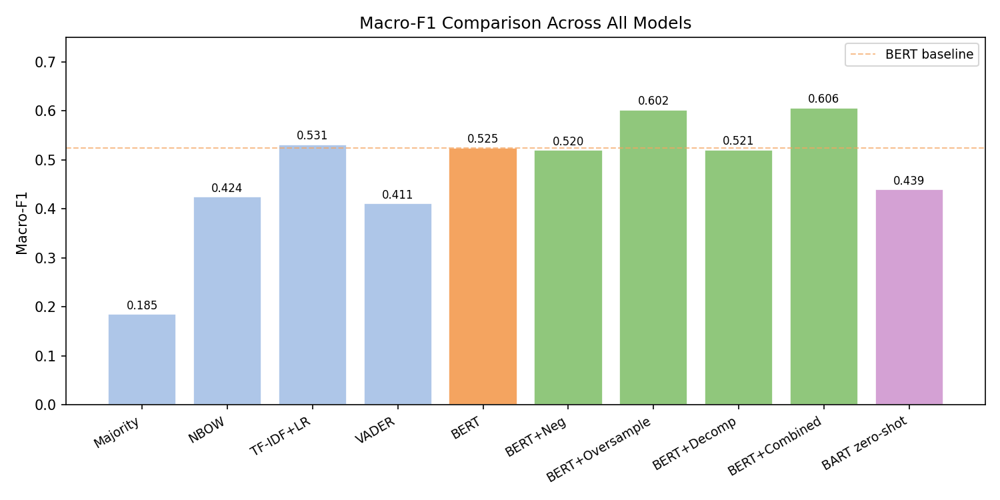
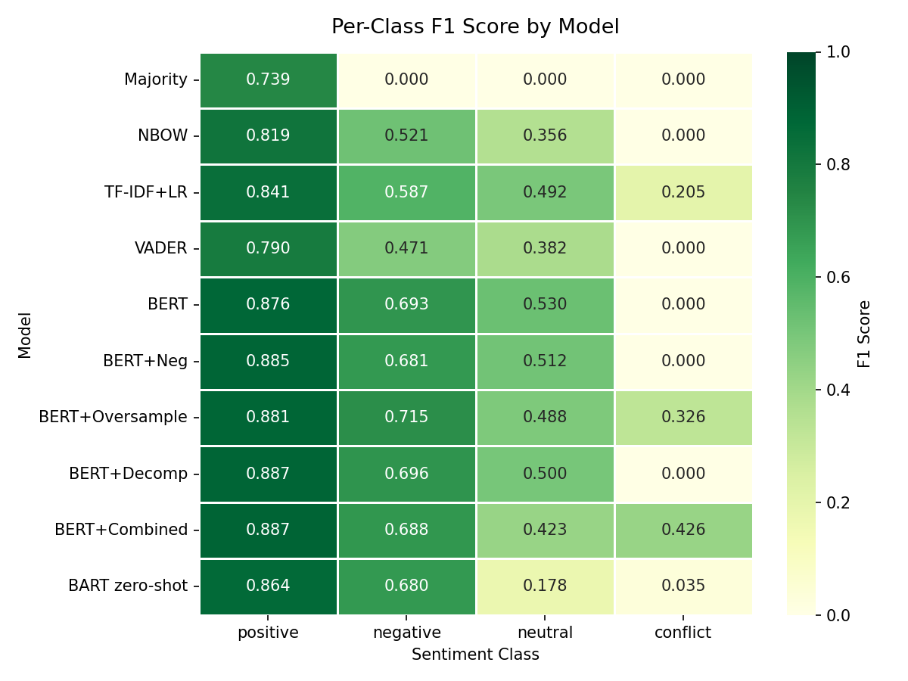
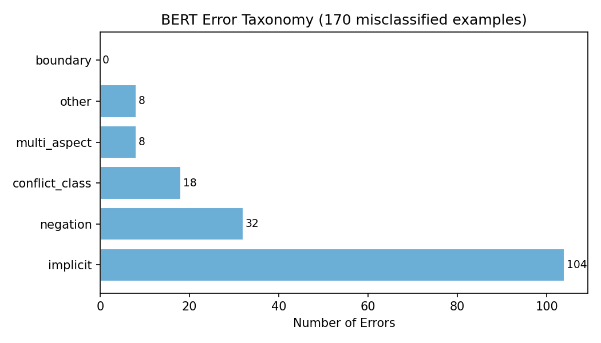
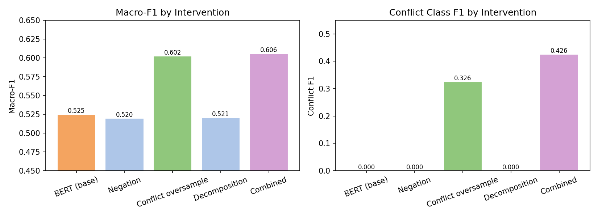

# ABSA Project — Diagnosing Failure Modes in Aspect-Based Sentiment Analysis

CS 4650 Natural Language Processing · Georgia Tech · Spring 2026

## Overview

This project investigates failure modes in Aspect-Based Sentiment Analysis (ABSA) using the SemEval-2014 restaurant reviews dataset. We compare baselines, fine-tune BERT, build an error taxonomy, apply targeted interventions, and benchmark against a zero-shot LLM.

## Viewing Results

**To view all results without re-running any models, open the notebook:**

```
notebooks/results_overview.ipynb
```

It loads pre-computed results from `results/` and displays:
- Full model comparison table (accuracy, macro-F1, per-class F1)
- Per-class F1 heatmap across all 10 models
- Macro-F1 bar chart
- Error taxonomy breakdown with counts and chart
- Intervention comparison (macro-F1 and conflict F1)
- Sample misclassified examples

## Project Structure

```
scripts/
  preprocess.py       # Dataset loading and train/test split
  evaluate.py         # Metrics computation and result saving
  error_taxonomy.py   # BERT error categorization (6-class taxonomy)
  interventions.py    # Negation marking, oversampling, decomposition

models/
  baselines.py        # Majority class, NBOW, TF-IDF+LR, VADER
  bert_model.py       # BERT-base fine-tuning
  llm_eval.py         # Zero-shot evaluation (local BART, Gemini, OpenAI)

notebooks/
  results_overview.ipynb  # Results viewer — start here

results/
  baselines.json
  bert.json
  errors.json
  interventions.json
  llm_local.json

report/
  contributions.md
```

## Running the Models

All results are already saved in `results/`. To re-run:

```bash
# Baselines
python models/baselines.py --output results/baselines.json

# BERT fine-tuning
python models/bert_model.py --output results/bert.json

# Error taxonomy
python scripts/error_taxonomy.py --input results/bert.json --output results/errors.json

# Interventions
python scripts/interventions.py --output results/interventions.json

# LLM zero-shot (local, no API key needed)
python models/llm_eval.py --provider local --output results/llm_local.json
```

## Dataset

`tomaarsen/setfit-absa-semeval-restaurants` (HuggingFace) · 3,693 labeled examples · stratified 80/20 split → 2,955 train / 738 test

## Results

### Macro-F1 Across All Models


### Per-Class F1 Heatmap


### Error Taxonomy (BERT misclassifications)


### Interventions: Macro-F1 and Conflict F1


## Requirements

```bash
pip install -r requirements.txt
```
